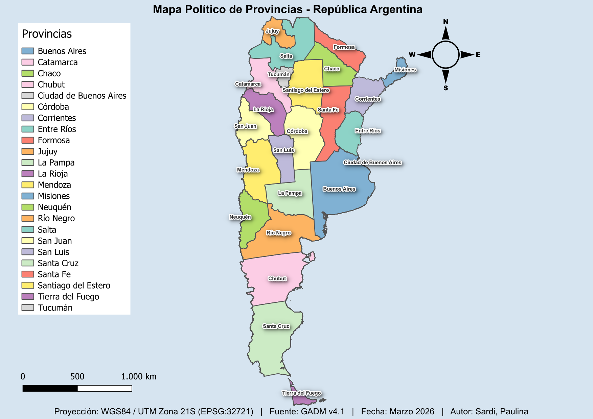

# 🗺️ P1 — Political Map of Argentina
### DRONEX Learning Path · Phase 1 · GIS & Cartography

First cartographic map built in QGIS as part of my roadmap 
toward professional drone mapping and GIS work in 
forestry and agriculture (Argentina → Uruguay).

---

## 📌 Project Goal
Produce a professional political map of Argentina with:
- Categorical symbology by province
- UTM Zone 21S projection (EPSG:32721)
- Full cartographic layout (title, legend, scale, north arrow)

---

## 🛠️ Tools Used
- QGIS 3.x
- GADM v4.1 (vector data source)
- Projection: WGS84 / UTM Zone 21S (EPSG:32721)

---

## 📂 Outputs
- `outputs/p1_mapa_provincias_argentina.pdf` — 300dpi print-ready map
- `outputs/preview.png` — map preview

---

## 🖼️ Preview

---

## 📚 What I Learned
- Loading and reprojecting vector shapefiles in QGIS
- Categorical symbology with custom color palettes
- Professional cartographic layout in Print Layout
- Exporting maps at 300dpi for print

---

*Part of my portfolio — documenting my journey from 
zero to professional GIS & drone mapping technician.*
